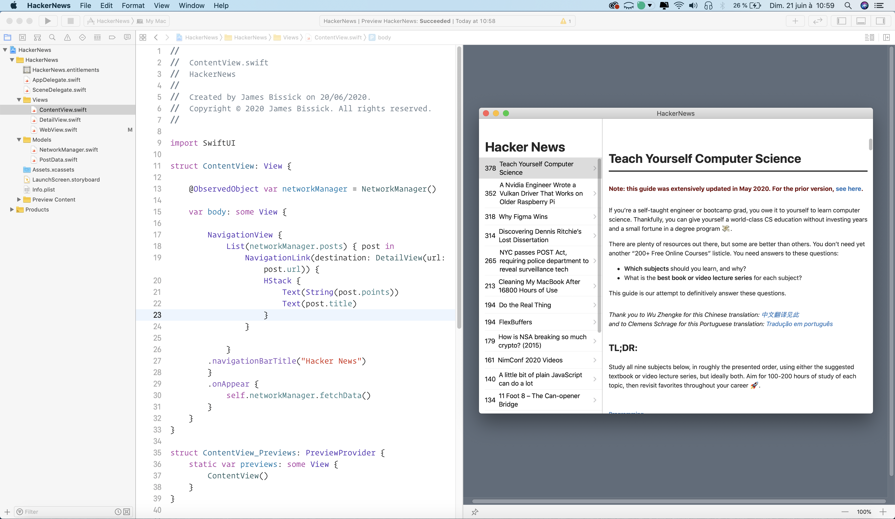

# HackerNews

  An iOS/macOS client for HackerNews made in SwiftUI

## Features

  * Robust routing
  * Focus on high performance
  * HTTP helpers (redirection, caching, etc)
  * View system supporting 2 template engines

## License

  [MIT](LICENSE)

