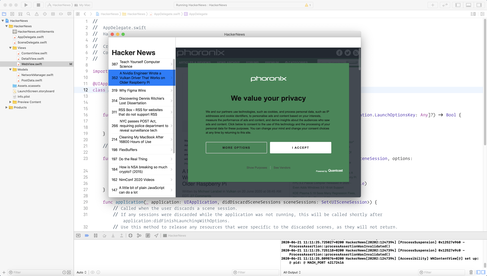

# HackerNews

  A iOS/macOS client for HackerNews made in SwiftUI

  [![NPM Version][npm-image]][npm-url]
  [![NPM Downloads][downloads-image]][downloads-url]
  [![Linux Build][travis-image]][travis-url]
  [![Windows Build][appveyor-image]][appveyor-url]
  [![Test Coverage][coveralls-image]][coveralls-url]

## Features

  * Robust routing
  * Focus on high performance
  * HTTP helpers (redirection, caching, etc)
  * View system supporting 2 template engines

## License

  [MIT](LICENSE)

[npm-image]: https://img.shields.io/npm/v/express.svg
[npm-url]: https://npmjs.org/package/express
[downloads-image]: https://img.shields.io/npm/dm/express.svg
[downloads-url]: https://npmcharts.com/compare/express?minimal=true
[travis-image]: https://img.shields.io/travis/expressjs/express/master.svg?label=linux
[travis-url]: https://travis-ci.org/expressjs/express
[appveyor-image]: https://img.shields.io/appveyor/ci/dougwilson/express/master.svg?label=windows
[appveyor-url]: https://ci.appveyor.com/project/dougwilson/express
[coveralls-image]: https://img.shields.io/coveralls/expressjs/express/master.svg
[coveralls-url]: https://coveralls.io/r/expressjs/express?branch=master
